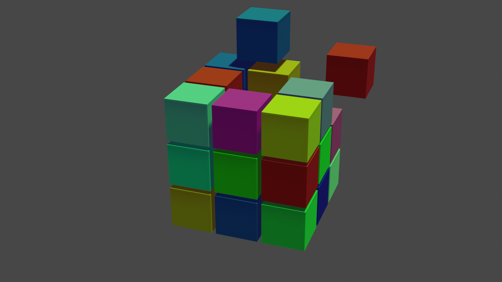

# Blender Designs 

Welcome to my Blender Designs Repository! Here you'll find  my designs including images, stickers, and other creative videos. This repository is a showcase of my skills and a resource for anyone interested in 3D design using Blender.

## Introduction
This repository contains various Blender projects I've worked on, including cubes, scenes, and blend files. It includes all necessary files such as `cubed.blend` files, textures, and rendered images.

## Installation
To get started with any of the projects in this repository, you'll need to have Blender installed on your machine. You can download the latest version of Blender from the [official website](https://www.blender.org/download/).

<h2 align="left">Languages and Tools</h2>

 

<h2 align="left">My Work</h2>

